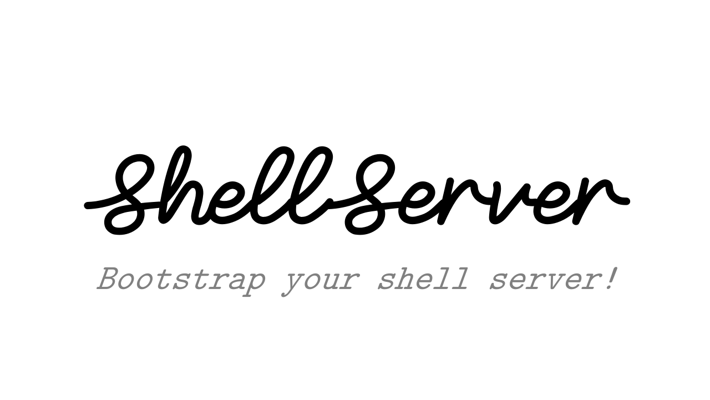
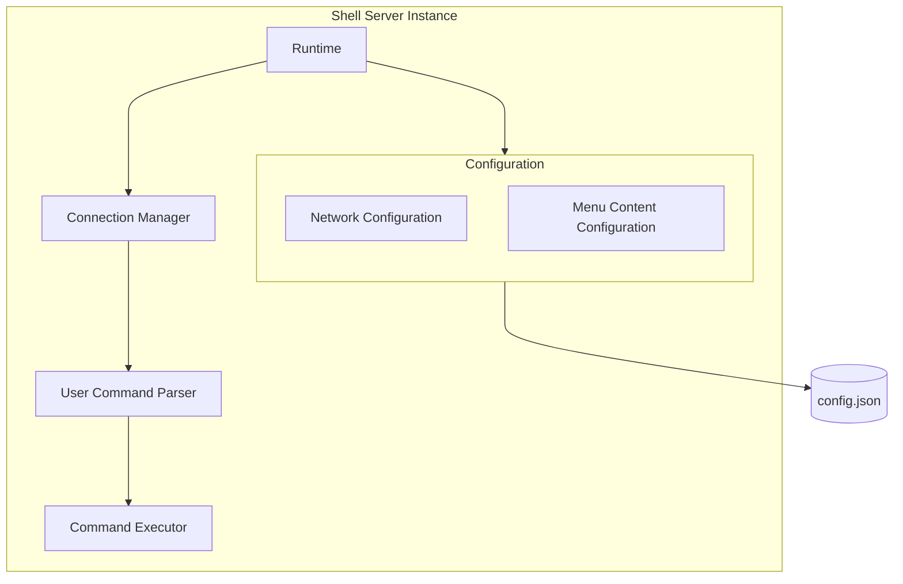

# Table of contents

- [Objective](#objective)
- [Design](#design)
- [Architecture](#architecture)
- [API](#api)

## Objective

`ShellServer` is a C++ library which allows you to bootstrap
your ShellServer cli. It basically means that it will facilitate
the creation of a server whose purpose is to interact with a given 
user via a connection.

Think of connecting to a server via Telnet for example and interacting
via the console in order to do some tasks.

The server side of the code will be facilitated using `ShellServer`.

## Design

`ShellServer` works in conjunction with a JSON configuration file.
This configuration file allows you to specify the prompt that will be 
displayed to the user as well as the network specification of your server 
(port, maximum number of concurrent connection, etc.).

The library will read this file in order to instantiate the server as you wish.
Then using the `ShellServer` object you will able to plugin callbacks that will
be executed following the commands sent by the user.

Responses to the callbacks will be displayed on screen.

## Architecture

The following `mermaid` diagram gives the high level details of the `ShellServer`'s architecture.



## API

### Create an instance to work with

To instantiate a `ShellServer` object and starting the server will be 
as easy as this:

```c++
#include <shellserver/shellserver.hpp>

ShellServer ss;
ss.LoadConfiguration("config.json");
ss.Run();
```

### Register callbacks for each command

To register the callbacks that will be called can be done like this:

```c++
void HelpCallback()
{
    std::cout << "Do nothing.\n"
}
...
ss.RegisterCallback("help",HelpCallback);
```

This way, a user connected via Telnet for instance will have the following:

```shell
> help
>   Do nothing
```

But `ShellServer` also support the registration of callbacks taking arguments like this:

```c++
void AdditionCallback(int a, int b)
{
    std::cout << a << "+" << b << " = " << (a+b) << '\n';
}
...
ss.RegisterCallback("add",AdditionCallback,1,2);
```

This way, a user connected via Telnet for instance will have the following:

```shell
> add 1 2
>   1+2 = 3
```

### Unregistering callbacks

To unregister a callback we can proceed as follow:

```c++
ss.UnregisterCallback("help");
```

## Configuration file

The configuration file is expected to be in a json format.
We will expect the following fields:

```json
{
  "network": {
    "port": 777,
    "number_of_connection": 10
  },
  "menu_content": {
    "help": {
      "name": "help",
      "aliases": ["-h","--help"],
      "help_text": [
        " -h|--help  : Print this menu.",
      ],
      "number_of_parameters": 0
    },
    "add": {
      "name": "add",
      "aliases": ["-a","--add"],
      "help_text": [
        " -a|--add <var1> <var2>  : Perform the addition between var1 and var2."
      ],
      "number_of_parameters": 2
    }
  }
}
```
